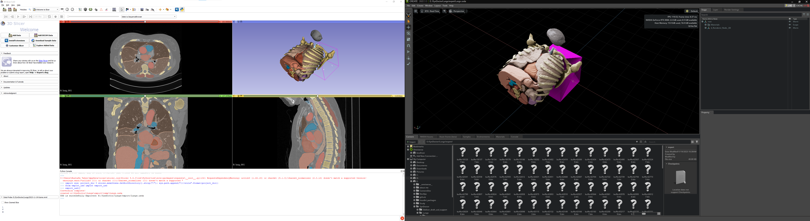
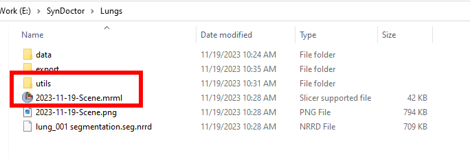
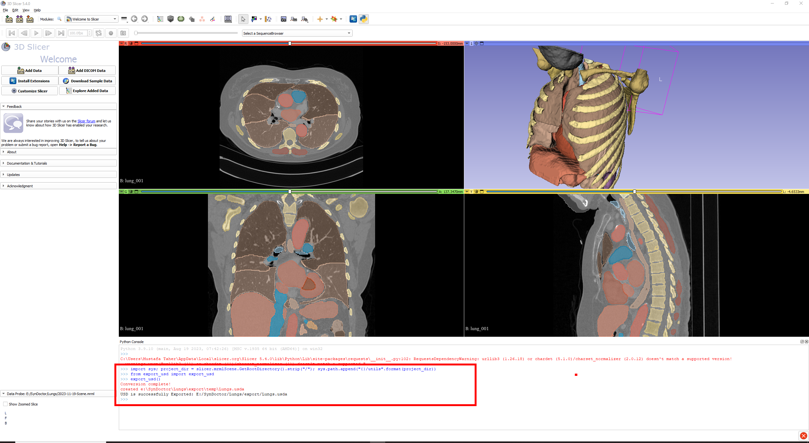

# 3d Slicer Draft USD Support

## Intro

USD support is the fundamental prerequisite for having a direct connection between 3d Slicer and Omniverse.



## Note
The code here is a rough proof of concept for [DataHack Hackathon by lablab.me](https://lablab.me/event/virtual-ai-datathon)

## How to use this draft: 

1. Copy utils folder to your project folder (next to `.mrml` file)

    

2. Install dependencies inside 3d slicer, by the following code.
    > this is done once.. 
    ```python
    import sys; import subprocess; subprocess.run([sys.executable, '-m', 'pip', 'install', 'usd-core']); subprocess.run([sys.executable, '-m', 'pip', 'install', 'unicodedata'])
    ```
3. Export and convert model, by Running the following code in 3d slicer's python shell.
    > USD file name is the same as the project folder name.
    ```python
    import sys; project_dir = slicer.mrmlScene.GetRootDirectory().strip("/"); sys.path.append("{}/utils".format(project_dir))

    from export_usd import export_usd
    export_usd()
    ```

    

## Example Project
Here, it's [Lungs](https://drive.google.com/file/d/13m36_3ba3O-YKJUyCEHFTVazc6fXfIeT/view?usp=drive_link)

## Watch a Demo
Here's me running the code

[](https://www.youtube.com/watch?v=xy2oOatX9oo)

## Appreciation
   Code credits [gltf2usd](https://github.com/kcoley/gltf2usd) by [kcoley](https://github.com/kcoley), I only made it work in 3d slicer.